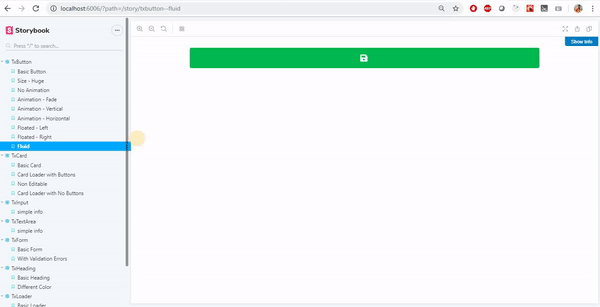
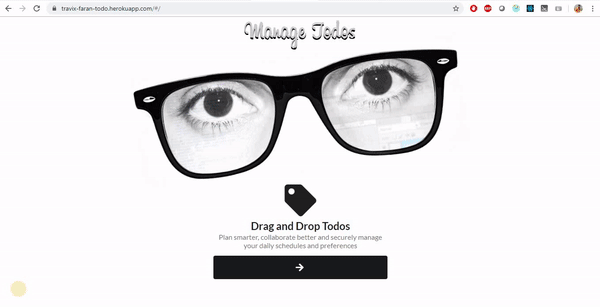
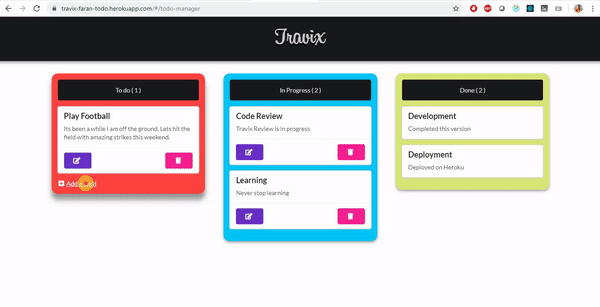
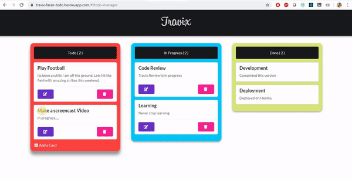
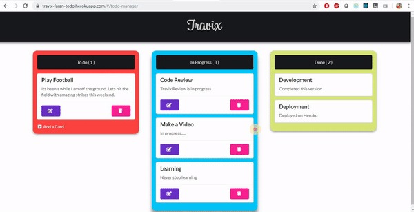
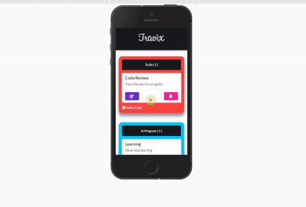
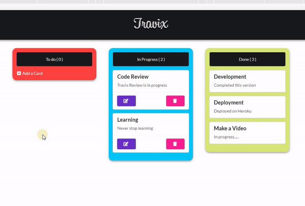

# Travix-Draggable-Todo

> Designed and implemented a production ready application for maintaining Todo application

> Technology used: `React 16` , `Redux` , `Redux-Thunk`, and `Express`

## [Live-Demo](https://travix-faran-todo.herokuapp.com)

> Live application can be accessed from : [Live-Demo](https://travix-faran-todo.herokuapp.com)

---

## Table of Contents

- [Installation](#installation)
- [Storybook](#storybook)
- [Features](#features)
- [Screencasts](#screencasts)

---

## Installation

> To proceed with smooth installation you should have Node 8+ version installed in your system

> Please clone this repo and then navigate to `Travix-Draggable-Todo` folder and run below commands in order to run this app locally.

```bash
# Install dependencies for server
npm install

# Install dependencies for client
npm run client-install

# Run the client & server with concurrently
npm run dev

```

---

## Storybook



> Storybook can be run with the following command:

```bash
# First navigate into client folder
cd client

# Run below command
npm run storybook

```

---

## Features

> Expected functionality:

- Add a Todo Task
- Save it on a server
- Edit a Todo Task
- Delete a Todo Task

> Out of excitement, I have added:

- Drag and Drop feature
- Categorized it into `Todo` , `InProgress` and `Done` state
- `Storybook`

---

## Screencasts

> Homepage



---

> Add a Todo Task



---

> Edit a Todo Task



---

> Delete a Todo Task



---

> Fully Responsive Layout




---
